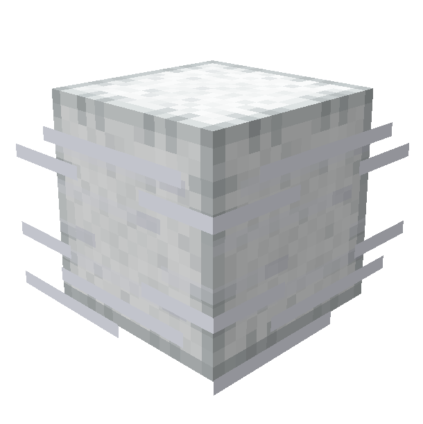
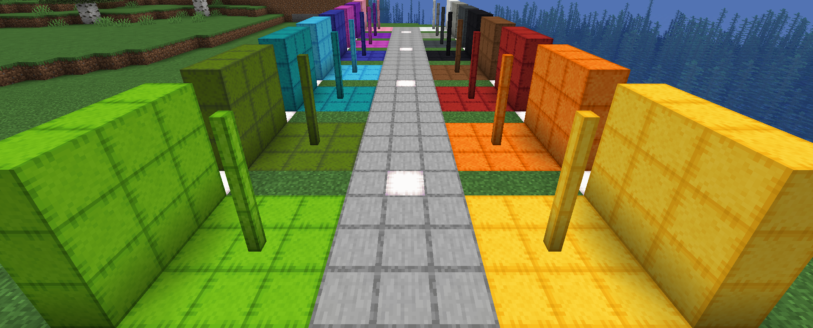

 

    

<h1 style="text-align: center;">Breeze Bounce </h1>

Bounce to new heights with Wind-Charged blocks! Inflate them for extra spring, or use them to 
create crazy obstacle courses.

## Current Features
***
### Bounce Blocks

Breeze Bounce has a set of Wind Charge-infused, wool-like blocks that will bounce entities that touch any side.
When struck by a wind charge the block becomes ‘Inflated’ for a short duration, while inflated bounce power is
increased. They are available as full blocks, stairs, slabs, and posts.

**Details**
- Colours: White, Light Gray, Gray, Black, Brown, Red, Orange, Yellow, Lime, Green, Cyan, Light Blue, Blue, Magenta, Purple, Pink
- Posts can be placed horizontally
- Stairs, Slabs, and Posts can be waterlogged

***Technical Details***
- When struck by a Wind Charge becomes inflated for 80 ticks
- Flammable and can be ignited by Lava
- Custom Sounds
  - When Player jumps
  - When Player bounces all sides
    - Pitch increase with greater velocity
  - Player Step
  - Inflate / Deflate

  
Crafting Recipe's

  <h3>Bounce Block</h3>
  1x Wind Charge, 4x Leather, 4x Wool -> 4x Bounce Blocks
  

  <h3>Bounce Stair Block</h3>
  6x Bounce Blocks -> 4x Bounce Stair Blocks
  
  
  <h3>Bounce Slab Block</h3>
  3x Bounce Blocks -> 6x Bounce Slab Blocks
  
  
  <h3>Bounce Post Block</h3>
  2x Bounce Blocks -> 8x Bounce Post Blocks
  

***

## Supported Versions
***
Breeze Bounce supports [Fabric](https://fabricmc.net) and [NeoForge](https://neoforged.net) for Minecraft 1.21+.

Please submit bugs [here](https://github.com/ChefMooon/breeze-bounce/issues)

## Planned Features
***
*subject to change*

- Velcro Armour
  - Player can 'stick' to blocks when shifting

- Inflation Machine
  - Can keep blocks 'inflated' within a radius
  - Uses Wind Charges as 'fuel'

- Bounce Block Improvements
  - Double Bounce (almost working)
    - When a player falls more than 2.4 blocks and is shifting when they land, they block below and
      within 1 block will be 'inflated'
    - 2.4 blocks allows the player to double bounce on and only on the initial jump from
      a Bounce block
    - Similar to how you would double bounce your friends on a trampoline
  - Improve Collision Detection
    - I have ideas but no more brain power

- Planned Config Options
  - Bounce Block
    - Ticks ‘inflated’
    - Base Bounce Power
    - Terminal Velocity
    - Double Jump Spread
    - Double Jump Activation Threshold

***Note:*** All planned features are subject to change. I wish they were complete for V1.0.0, but they
are outside my ability for now. I will implement them after Modfest with more time and learning!

***

***Known Bugs***
- Some Funky collisions in corners with AbstractBreezeBlocks
- When bouncing while sliding on ice you stop after a short time